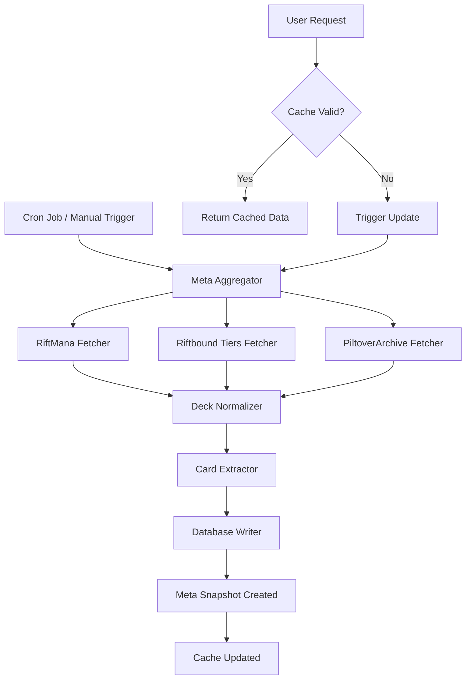

# Popular Decks & Cards Feature - Implementation Plan

## Overview
Add a feature to display popular/successful decks and cards from the current meta by aggregating data from multiple Riftbound community sites.

## Data Sources Analysis

### 1. RiftMana.com ⭐ (Primary Source for Decks)
- **URL**: https://riftmana.com/decks/
- **Accessibility**: ✅ Good - No CAPTCHA, loads well
- **Data Available**:
  - Trending decks with deck names
  - Deck prices (e.g., $80.73, $346.39)
  - Deck archetypes/legends (icons visible)
  - Author information
  - View counts and timestamps
  - Tags: Competitive, Combo, Control, Midrange
- **Update Frequency**: Shows "1 week ago", "6 days ago" timestamps
- **API Status**: Unknown - needs investigation
- **Scraping Feasibility**: ✅ High - Clean HTML structure

### 2. Riftbound.gg/tier-list ⭐ (Primary Source for Meta Tiers)
- **URL**: https://riftbound.gg/tier-list/
- **Accessibility**: ✅ Good - Loads reliably
- **Data Available**:
  - S Tier, Tier 1, Tier 2, Tier 3 classifications
  - Deck names and champion combinations
  - Last updated: January 23, 2026
  - Separate tier lists for Origins and Spiritforged sets
- **Update Frequency**: Updated periodically (shows update date)
- **API Status**: Unknown - needs investigation
- **Scraping Feasibility**: ✅ High - Structured content

### 3. PiltoverArchive.com (Secondary Source)
- **URL**: https://piltoverarchive.com/decks
- **Accessibility**: ✅ Good - Clean interface
- **Data Available**:
  - Tournament results (1st Place, 2nd Place, etc.)
  - Deck names with champion combinations
  - View counts (43.3k, 27.3k, 48.7k views)
  - Deck prices
  - Author information (Challenger TCG, Moe Kaake)
  - Set tags (OGN, SFD, BFD)
- **Update Frequency**: Shows recent tournament results
- **API Status**: Unknown - needs investigation
- **Scraping Feasibility**: ✅ High - Well-structured

### 4. Mobalytics.gg (Tertiary Source)
- **URL**: https://mobalytics.gg/riftbound/
- **Accessibility**: ⚠️ Moderate - Some JavaScript errors
- **Data Available**:
  - Tournament winning decks
  - Deck guides and explanations
  - Meta tier lists
- **Update Frequency**: Regular updates
- **API Status**: Unknown - needs investigation
- **Scraping Feasibility**: ⚠️ Medium - Heavy JavaScript, may need headless browser

### 5. RiftDecks.com (Not Recommended)
- **URL**: https://riftdecks.com
- **Accessibility**: ❌ Poor - CAPTCHA protection
- **Scraping Feasibility**: ❌ Low - Anti-bot measures

### 6. Riftbound.gg/DECKS (Not Recommended)
- **URL**: https://riftbound.gg/DECKS/
- **Accessibility**: ❌ Poor - Loading issues, navigation timeout
- **Scraping Feasibility**: ❌ Low - Unreliable

## Recommended Approach

### Phase 1: API Investigation (Priority)
1. Check for public APIs or developer documentation
2. Look for RSS feeds or JSON endpoints
3. Check robots.txt for scraping permissions
4. Contact site owners if needed for API access

### Phase 2: Data Architecture

#### Database Schema

```sql
-- Meta snapshots table (tracks when data was fetched)
CREATE TABLE meta_snapshots (
  id UUID PRIMARY KEY DEFAULT uuid_generate_v4(),
  source TEXT NOT NULL, -- 'riftmana', 'riftbound_tierlist', 'piltoverarchive'
  snapshot_date TIMESTAMP WITH TIME ZONE NOT NULL,
  data_hash TEXT, -- To detect if data changed
  created_at TIMESTAMP WITH TIME ZONE DEFAULT NOW()
);

-- Popular decks table
CREATE TABLE popular_decks (
  id UUID PRIMARY KEY DEFAULT uuid_generate_v4(),
  snapshot_id UUID REFERENCES meta_snapshots(id) ON DELETE CASCADE,
  deck_name TEXT NOT NULL,
  deck_code TEXT, -- If available
  champions TEXT[], -- Array of champion names
  archetype TEXT, -- 'Aggro', 'Control', 'Combo', 'Midrange'
  tier_rank TEXT, -- 'S', '1', '2', '3'
  popularity_score INTEGER, -- Normalized score 0-100
  view_count INTEGER,
  win_rate DECIMAL(5,2), -- If available
  price_usd DECIMAL(10,2), -- If available
  source_url TEXT,
  author TEXT,
  last_updated TIMESTAMP WITH TIME ZONE,
  metadata JSONB, -- Additional data
  created_at TIMESTAMP WITH TIME ZONE DEFAULT NOW()
);

-- Popular cards table (derived from popular decks)
CREATE TABLE popular_cards (
  id UUID PRIMARY KEY DEFAULT uuid_generate_v4(),
  snapshot_id UUID REFERENCES meta_snapshots(id) ON DELETE CASCADE,
  card_id UUID REFERENCES cards(id) ON DELETE CASCADE,
  usage_count INTEGER NOT NULL, -- How many top decks use this card
  usage_percentage DECIMAL(5,2), -- Percentage of top decks
  avg_copies DECIMAL(3,1), -- Average copies per deck
  tier_distribution JSONB, -- How many S/T1/T2/T3 decks use it
  metadata JSONB,
  created_at TIMESTAMP WITH TIME ZONE DEFAULT NOW(),
  UNIQUE(snapshot_id, card_id)
);

-- Indexes for performance
CREATE INDEX idx_popular_decks_snapshot ON popular_decks(snapshot_id);
CREATE INDEX idx_popular_decks_tier ON popular_decks(tier_rank);
CREATE INDEX idx_popular_decks_popularity ON popular_decks(popularity_score DESC);
CREATE INDEX idx_popular_cards_snapshot ON popular_cards(snapshot_id);
CREATE INDEX idx_popular_cards_usage ON popular_cards(usage_percentage DESC);
CREATE INDEX idx_meta_snapshots_date ON meta_snapshots(snapshot_date DESC);
```

### Phase 3: Data Fetching Services

#### Service Architecture

```
lib/
  meta-data/
    sources/
      riftmana.ts          # RiftMana scraper/API client
      riftbound-tiers.ts   # Riftbound tier list scraper/API client
      piltover.ts          # PiltoverArchive scraper/API client
    transformers/
      deck-normalizer.ts   # Normalize deck data from different sources
      card-extractor.ts    # Extract card usage from deck lists
    meta-aggregator.ts     # Combine data from all sources
    cache-manager.ts       # Handle 24-hour caching
```

#### Data Flow



### Phase 4: API Routes

```typescript
// app/api/meta/decks/route.ts
GET /api/meta/decks
  Query params:
    - tier: 'S' | '1' | '2' | '3' | 'all'
    - archetype: 'Aggro' | 'Control' | 'Combo' | 'Midrange' | 'all'
    - limit: number (default 20)
    - source: 'riftmana' | 'riftbound' | 'piltover' | 'all'
  Response: Array of popular decks with metadata

// app/api/meta/cards/route.ts
GET /api/meta/cards
  Query params:
    - limit: number (default 50)
    - minUsage: number (minimum usage percentage)
    - tier: filter by tier distribution
  Response: Array of popular cards with usage stats

// app/api/meta/refresh/route.ts
POST /api/meta/refresh
  Body: { force: boolean }
  Response: { success: boolean, snapshot_id: string }
  Note: Protected route, requires authentication
```

### Phase 5: UI Components

#### Main Page - Popular Decks Section

```typescript
// components/PopularDecks.tsx
- Display top 6-8 decks in a grid
- Show deck name, champions, tier badge
- Display popularity metrics (views, usage %)
- Link to deck details (external or internal)
- Filter by tier (S/1/2/3)
- "Last updated: X hours ago" timestamp
```

#### Cards Page - Popular Cards Section

```typescript
// components/PopularCards.tsx
- Display top 20-30 cards in a grid
- Show card image, name, usage percentage
- Display "Used in X% of top decks"
- Show tier distribution (S: 5, T1: 8, T2: 3)
- Filter by usage threshold
- Highlight cards user owns/wants
```

### Phase 6: Cron Job Configuration

#### Options for Daily Updates

**Option 1: Vercel Cron Jobs** (Recommended for Vercel deployment)
```json
// vercel.json
{
  "crons": [{
    "path": "/api/meta/refresh",
    "schedule": "0 6 * * *"  // 6 AM UTC daily
  }]
}
```

**Option 2: GitHub Actions** (Platform-agnostic)
```yaml
# .github/workflows/update-meta.yml
name: Update Meta Data
on:
  schedule:
    - cron: '0 6 * * *'  # 6 AM UTC daily
  workflow_dispatch:  # Allow manual trigger
jobs:
  update:
    runs-on: ubuntu-latest
    steps:
      - name: Trigger meta refresh
        run: |
          curl -X POST ${{ secrets.APP_URL }}/api/meta/refresh \
            -H "Authorization: Bearer ${{ secrets.CRON_SECRET }}"
```

**Option 3: Supabase Edge Functions** (If using Supabase)
```typescript
// supabase/functions/update-meta/index.ts
Deno.serve(async (req) => {
  // Trigger meta data update
  // Can be scheduled via Supabase cron
});
```

### Phase 7: Implementation Checklist

#### Week 1: Research & Setup
- [ ] Investigate APIs for all sources
- [ ] Test scraping feasibility
- [ ] Check robots.txt and terms of service
- [ ] Set up database migrations
- [ ] Create base service structure

#### Week 2: Data Fetching
- [ ] Implement RiftMana fetcher
- [ ] Implement Riftbound tier list fetcher
- [ ] Implement PiltoverArchive fetcher (optional)
- [ ] Create data normalizers
- [ ] Build card extraction logic
- [ ] Test data aggregation

#### Week 3: API & Caching
- [ ] Build API routes
- [ ] Implement caching mechanism
- [ ] Set up cron job
- [ ] Add error handling and logging
- [ ] Test data refresh cycle

#### Week 4: UI & Polish
- [ ] Create PopularDecks component
- [ ] Create PopularCards component
- [ ] Integrate into main page
- [ ] Integrate into cards page
- [ ] Add loading states
- [ ] Add error states
- [ ] Write documentation
- [ ] Deploy and test

## Technical Considerations

### Rate Limiting & Respectful Scraping
```typescript
// lib/meta-data/rate-limiter.ts
- Implement delays between requests (1-2 seconds)
- Respect robots.txt
- Use appropriate User-Agent
- Cache aggressively to minimize requests
- Implement exponential backoff on errors
```

### Error Handling Strategy
```typescript
// If one source fails:
1. Log error with details
2. Continue with other sources
3. Use cached data if available
4. Show partial results to users
5. Retry failed source on next cycle
```

### Performance Optimization
- Use database indexes for fast queries
- Implement pagination for large result sets
- Cache API responses in memory (short-term)
- Use database caching (24-hour snapshots)
- Lazy load images in UI
- Implement virtual scrolling for long lists

### Data Quality
- Validate data structure before saving
- Normalize deck names (handle variations)
- Match cards to existing card database
- Handle missing/incomplete data gracefully
- Track data freshness and staleness

## Dependencies to Add

```json
{
  "dependencies": {
    "cheerio": "^1.0.0-rc.12",  // HTML parsing for scraping
    "node-cron": "^3.0.3",       // Cron job scheduling (if not using Vercel)
    "zod": "^3.22.4"             // Data validation
  },
  "devDependencies": {
    "@types/cheerio": "^0.22.35",
    "@types/node-cron": "^3.0.11"
  }
}
```

## Environment Variables

```env
# Meta Data Configuration
META_UPDATE_ENABLED=true
META_CACHE_DURATION_HOURS=24
CRON_SECRET=your_secret_for_cron_authentication

# Optional: If APIs require keys
RIFTMANA_API_KEY=
RIFTBOUND_API_KEY=
PILTOVER_API_KEY=
```

## Success Metrics

- [ ] Data updates successfully every 24 hours
- [ ] Popular decks display on main page
- [ ] Popular cards display on cards page
- [ ] Data is accurate and up-to-date
- [ ] Page load time < 2 seconds
- [ ] No scraping errors or rate limit issues
- [ ] Users can filter and sort results
- [ ] Mobile-responsive design

## Future Enhancements

1. **Deck Builder Integration**: Allow users to import popular decks
2. **Price Tracking**: Track deck price changes over time
3. **Meta History**: Show how meta evolved over weeks/months
4. **Notifications**: Alert users when their cards become meta
5. **Deck Comparison**: Compare user's collection to meta decks
6. **Win Rate Data**: If available from sources
7. **Tournament Results**: Integrate tournament data
8. **Card Synergies**: Show which cards are played together

## Risk Mitigation

### Risk: Sites block scraping
**Mitigation**: 
- Contact site owners for API access
- Implement respectful scraping practices
- Have fallback to manual data entry
- Use multiple sources for redundancy

### Risk: Data structure changes
**Mitigation**:
- Implement robust error handling
- Add data validation layer
- Monitor for parsing errors
- Have alerts for failed updates

### Risk: Performance issues
**Mitigation**:
- Implement aggressive caching
- Use database indexes
- Paginate results
- Lazy load images
- Monitor query performance

### Risk: Stale data
**Mitigation**:
- Show "last updated" timestamp
- Allow manual refresh
- Set up monitoring alerts
- Have fallback to cached data

## Next Steps

1. **Immediate**: Investigate API availability for each source
2. **Short-term**: Set up database schema and migrations
3. **Medium-term**: Implement data fetching for primary sources
4. **Long-term**: Build UI components and integrate into app

---

**Last Updated**: January 30, 2026
**Status**: Planning Phase
**Priority**: High